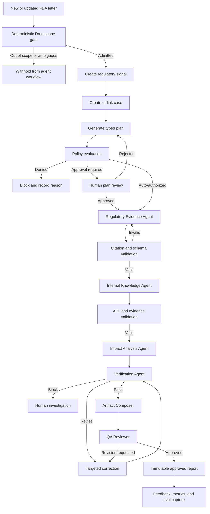

# PharmaAgent OS — Complete Implementation Plan

**Document purpose:** Product, architecture, agent, workflow, security, evaluation, and delivery specification  
**Target organization:** Daewoong Pharmaceutical / Daewoong Group  
**Prepared:** September 4, 2026  
**Recommended repository path:** `docs/product/PHARMA_AGENT_OS_SPEC.md`

---

## September 11 implementation addendum: Research-first upgrade

The subsequent approved Research-first production upgrade is specified in
`ATTIO_UPGRADE_IMPLEMENTATION.md`. It adds explicit evidence context, personal
case execution and acknowledgments, production specialist adapters and observed
evaluation. Public users retain browser-session ownership; global operations
remain privileged. Existing governed independent-QA rules remain intact.

## September 11 implementation addendum: prepared startup

On each fresh document load, animate the supplied 24 FDA-folder frames while
preparing every menu accessible to the signed browser session. Share navigation
definitions, client modules and first-page query data; preserve the opening URL.
Reveal the prepared screen with a 600 ms opacity transition. Reduced motion uses
a static frame and immediate reveal. Do not replay on internal navigation.

Preparation uses four concurrent menu tasks (two on constrained connections),
validated private reads and the existing owner-scoped memory cache. Secondary
menus use thin routes and authenticated, allowlisted read endpoints. Trends send
computed summaries rather than a full browser catalogue. Inbox warmup uses a
read-only preview; only an actual visit establishes its personal horizon.

After failure or 15 seconds, name unfinished steps and offer Retry or Continue
with available menus. Readiness is based on code/data/initial-render completion,
never a router-prefetch invocation. Deep records and additional pages remain on
demand. `PORTAL_STARTUP_ENABLED=false` disables the gate while retaining caching.
No schema migration is required. Roll out the Inbox preview API before the web
startup gate; record test and hosted verification in the implementation handoff.

## September 10 implementation addendum: personal workspace

The user approved implementation of the Linear research adaptation. Apply the
attached light shell with the existing indigo identity, local Pretendard and
Streamline assets. Primary destinations are Research, Sources, Saved work, Inbox
and Chat; formal team review and operational controls remain separate.

Implement persistent research/source lists with contextual evidence inspection,
owner-scoped memory caching, shared command actions, title/metadata search,
revision-aware saved views, immutable completed-brief snapshots and a personal
source-change inbox. New/Later/Done/Dismissed are personal triage states; they do
not approve evidence, close a case or create a compliance decision. The first
inbox visit establishes a fixed horizon thirty days earlier. Preserve existing
browser-session identity, source admission, pinned evidence and run controls.

The implementation map, migration order, validation evidence and deployment
limits are recorded in [LINEAR_WORKSPACE_IMPLEMENTATION.md](LINEAR_WORKSPACE_IMPLEMENTATION.md).
The current status remains in the implementation handoff. This addendum changes
workspace interaction and adds personal persistence; the governed platform
requirements below remain authoritative.

---

## 1. Product definition

**PharmaAgent OS is a governed, case-based AI agent platform that converts external pharmaceutical regulatory signals into evidence-backed internal review packages.**

Its flagship workflow is:

> **New FDA Warning Letter → regulatory findings → relevant internal documents and processes → potential impact hypotheses → independent verification → human-approved impact report**

It is **not** an autonomous compliance system. It must not independently:

- declare a GMP gap or internal noncompliance;
- create or approve a CAPA;
- revise an SOP;
- release or reject product;
- control manufacturing or laboratory equipment;
- submit content to a regulator;
- write into controlled QMS, EDMS, MES, or LIMS records.

The intended use is regulatory intelligence and human decision support. Official source evidence remains authoritative, and formal reassessment is required before any output becomes a GxP record or directly affects a regulated process.

---

## 2. Product strategy

### 2.1 Do not rebuild the FDA platform

The existing FDA Drug Warning Letter Intelligence Platform already provides a strong foundation:

- deterministic FDA `Product: Drugs` admission;
- immutable document versions;
- retained source hashes and source anchors;
- structured findings and summaries;
- authorization-aware retrieval;
- reviewer workflows;
- audit events;
- source-grounded chat;
- PostgreSQL and pgvector deployment preparation;
- security controls and production handover documentation.

The existing data model also already covers warning letters, document versions, immutable source hashes, findings, chunks, embeddings, review states, model versions, prompt versions, schema versions, and taxonomy versions.

Therefore, the existing system becomes the **Regulatory Evidence Service** inside PharmaAgent OS.

```text
Existing FDA Intelligence Platform
              │
              │ becomes
              ▼
      Regulatory Evidence Service
              │
              ▼
       PharmaAgent OS
```

### 2.2 New layers to add

```text
Case Management
Agent Registry
Skill Registry
MCP Tool Gateway
Workflow Orchestration
Internal Knowledge Retrieval
Impact Analysis
Human Approval
Agent Evaluation
Agent Control Tower
Durable Execution
```

---

## 3. Daewoong hiring alignment

Recent Daewoong Group agent-platform hiring signals emphasize:

- Skills, Agents, and Hooks;
- lifecycle controls such as `SessionStart`, `PreToolUse`, `PostToolUse`, and `Stop`;
- Model Context Protocol servers;
- REST APIs and webhooks;
- agent and plugin version management;
- Markdown-based agent definitions;
- secret and token management;
- bridge-server operation;
- monitoring and incident response;
- expansion of agent components into additional business domains.

PharmaAgent OS should demonstrate the **complete agent lifecycle**, not only a multi-agent demo:

```text
Define
  ↓
Version
  ↓
Test
  ↓
Approve
  ↓
Deploy
  ↓
Run
  ↓
Observe
  ↓
Evaluate
  ↓
Improve
  ↓
Rollback
```

---

## 4. Commercial agent-platform patterns to replicate

Current enterprise agent products are converging on a common architecture:

- shared enterprise context;
- identity and least-privilege permissions;
- task or case-based execution;
- durable sessions and workflows;
- tool gateways using open standards;
- human approval for sensitive operations;
- secure execution environments;
- tracing, evaluation, and release governance;
- centralized inventory, health, cost, and risk monitoring;
- provider-independent model routing.

### 4.1 Pattern mapping

| Commercial pattern | PharmaAgent OS implementation |
|---|---|
| Shared enterprise context | Versioned regulatory and internal knowledge layer |
| Managed identity | User, service, agent, and tool identities |
| Task control plane | Every run belongs to a governed case |
| Durable workflows | Persisted state, retries, pause, resume, and approval |
| Agent and skill registry | Versioned definitions with owners and release status |
| Tool gateway | Allowlisted MCP servers with scoped permissions |
| Plan-level human control | Review the complete plan before sensitive execution |
| Secure execution | Separate sandbox for untrusted processing |
| Evaluation center | Regression, trajectory, outcome, safety, and resilience tests |
| Control tower | Health, quality, cost, incidents, adoption, and value |
| Open standards | MCP for tools; A2A later for independent agents |
| Model independence | Provider adapters and policy-based model routing |

### 4.2 Patterns to avoid

Do not build:

- a free-form swarm that can create unlimited subagents;
- one chatbot with hundreds of tools loaded into a single prompt;
- arbitrary SQL, shell, browser, or URL tools;
- automatic long-term memory from every conversation;
- approval prompts for every harmless read operation;
- direct writes into controlled QMS, EDMS, MES, or LIMS systems;
- a visual workflow builder as the initial source of truth;
- hidden autonomous behavior that cannot be reconstructed from logs.

Start with simple, composable workflows and introduce autonomy only where the task genuinely requires model-directed flexibility.

---

## 5. Product architecture

PharmaAgent OS should contain six logical planes.

```text
┌───────────────────────────────────────────────────────────┐
│ 1. EXPERIENCE PLANE                                       │
│ Case Workspace · Signal Inbox · Review · Agent Studio      │
│ Eval Center · Control Tower                                │
├───────────────────────────────────────────────────────────┤
│ 2. CONTROL PLANE                                          │
│ Agent Registry · Skill Registry · Tool Registry            │
│ Policy · Versions · Releases · Budgets · Model Routing     │
├───────────────────────────────────────────────────────────┤
│ 3. WORKFLOW PLANE                                         │
│ Durable Case Workflow · Approval · Retry · Pause/Resume    │
│ LangGraph orchestration inside Temporal workflows          │
├───────────────────────────────────────────────────────────┤
│ 4. AGENT RUNTIME PLANE                                    │
│ Orchestrator · Regulatory · Knowledge · Impact · Critic    │
├───────────────────────────────────────────────────────────┤
│ 5. TOOL AND DATA PLANE                                    │
│ MCP Gateway · FDA Corpus · Internal Documents · Graph      │
│ PostgreSQL/pgvector · Object Store · Notification Outbox   │
├───────────────────────────────────────────────────────────┤
│ 6. ASSURANCE PLANE                                        │
│ Traces · Evals · Audit · Security Events · Cost · Feedback │
└───────────────────────────────────────────────────────────┘
```

### 5.1 Architectural principle: case first, chat second

A chatbot conversation is insufficient as the system’s primary business object.

The central object must be a **Case**:

```text
Case
├── Objective
├── Source snapshot
├── Internal scope
├── Approved plan
├── Assigned agents
├── Agent and skill versions
├── Tool permissions
├── Evidence
├── Impact hypotheses
├── Human decisions
├── Artifacts
├── Complete trace
└── Outcome
```

Chat remains available inside the case, but the case is the durable control and audit object.

---

## 6. User roles

| Role | Primary responsibilities | Important permissions |
|---|---|---|
| Viewer | Search approved regulatory content | Read approved artifacts only |
| Regulatory Analyst | Start cases and analyze FDA evidence | Run read-only regulatory workflows |
| QA Reviewer | Review impact packages | Approve, reject, or request revision |
| Domain SME | Assess QC, manufacturing, DI, validation, or training relevance | Comment on and decide internal mappings |
| Auditor | Inspect evidence and history | Read-only audit and version access |
| Agent Developer | Develop agents, skills, tools, and evals | Publish only to development or staging |
| Platform Administrator | Operate infrastructure and policies | Cannot approve regulatory content by default |
| System Owner | Own intended use and release decisions | Approves production agent versions |

The QA Reviewer and Platform Administrator must be separated. A platform administrator must not be able to silently approve AI-derived regulatory content.

---

# 7. Product features

## 7.1 Regulatory Signal Inbox

This converts a basic “new FDA letter” notification into an operational triage interface.

### User-facing functions

Each signal card displays:

```text
Company
FDA issuing office
Issue date
Posting date
Product classification
Drug subtype
Finding categories
Lifecycle: NEW / UPDATED / RETIRED
Source version
Potential organizational relevance
Review status
Associated cases
```

Users can:

- inspect official source evidence;
- compare current and previous source versions;
- open a regulatory analysis case;
- assign a reviewer;
- subscribe to similar signals;
- dismiss a signal with a documented reason;
- link multiple related warning letters into one case.

### Backend behavior

The existing deterministic ingestion process remains authoritative.

AI may suggest:

- GMP domains;
- likely organizational functions;
- preliminary review priority;
- similar historical cases.

AI must not determine whether a letter enters the Drug corpus.

### Signal states

```text
NEW
TRIAGED
CASE_CREATED
UNDER_REVIEW
CLOSED
DISMISSED
SOURCE_UPDATED
```

### Acceptance criteria

- Repeated ingestion does not create duplicate signals.
- Changed FDA content creates a new immutable source version.
- Every signal points to an exact source version.
- AI triage is visibly marked as derived.
- A case cannot silently move to a newer source version.

---

## 7.2 Case Workspace

This is the central product screen.

```text
┌──────────────────────────────────────────────────────────┐
│ Case title · State · Priority · Owner · Run controls      │
├───────────────────┬──────────────────────┬───────────────┤
│ Objective & Plan  │ Agent Activity       │ Evidence      │
│                   │                      │               │
│ Step 1            │ Regulatory Agent ✓   │ FDA anchor    │
│ Step 2            │ Knowledge Agent ...  │ SOP anchor    │
│ Step 3            │ Impact Agent waiting │ Source hash   │
│                   │                      │ Trust level   │
├───────────────────┴──────────────────────┴───────────────┤
│ Overview | Findings | Impact Map | Report | Trace | Review│
└──────────────────────────────────────────────────────────┘
```

### Core functions

- define or revise the case objective;
- choose a workflow template;
- pin external and internal document versions;
- inspect the proposed plan;
- approve, edit, or reject the plan;
- start, pause, resume, cancel, or retry a run;
- observe agents and tool calls;
- inspect evidence supporting each result;
- intervene without deleting previous history;
- compare artifact revisions;
- submit a final package for QA review.

### Case states

```text
DRAFT
PLANNING
AWAITING_PLAN_APPROVAL
READY
RUNNING
WAITING_FOR_INPUT
WAITING_FOR_REVIEW
NEEDS_REVISION
COMPLETED
BLOCKED
FAILED
CANCELLED
STALE
```

A **Case** and a **Run** are separate. One case may contain multiple runs using different agent or model versions.

### Durability requirement

A browser refresh, application restart, worker crash, or multi-day approval wait must not lose workflow state.

---

## 7.3 Plan Mode

Before a complex workflow starts, the Orchestrator generates a visible typed plan.

```text
PLAN VERSION: 3

Objective
Determine whether the selected FDA findings may be relevant to
the mock sterile-manufacturing quality system.

Step 1
Agent: Regulatory Evidence Agent v1.3.0
Tools: regulatory.get_version, regulatory.get_anchor
Output: RegulatoryFinding[]
Risk: Read-only public evidence

Step 2
Agent: Internal Knowledge Agent v1.1.0
Tools: knowledge.search_assets, knowledge.get_document_version
Output: InternalAssetCandidate[]
Risk: Read-only internal-confidential content

Step 3
Agent: Impact Analysis Agent v1.0.2
Output: ImpactHypothesis[]
Risk: Derived decision-support analysis

Step 4
Agent: Verification Agent v1.2.1
Output: VerificationReport
Risk: No side effects

Expected artifact
Regulatory Impact Review Package

Maximum tool calls: 32
Maximum correction loops: 2
Maximum budget: configured case budget
External actions: none
```

The user can:

- remove unnecessary steps;
- reduce the document scope;
- change workflow templates;
- add a domain lens such as data integrity or sterile manufacturing;
- approve the plan;
- reject it with a reason.

### Approval policy

| Operation | Required control |
|---|---|
| Read public FDA evidence | Automatically allowed |
| Read authorized internal documents | Covered by approved case plan |
| Generate internal draft | Artifact review required |
| Create a non-GxP task | Explicit action approval |
| Send an external notification | Explicit action approval |
| Modify a controlled document or QMS record | Prohibited initially |

---

## 7.4 Evidence Explorer

Every material claim must be inspectable.

### Evidence trust hierarchy

```text
Level A — Authoritative external evidence
Official FDA document and retained source version

Level B — Controlled internal evidence
Approved internal SOP, policy, or process version

Level C — User-provided context
Unverified unless linked to a retained source

Level D — AI-derived content
Finding, hypothesis, summary, or recommendation

Level E — Model working state
Never treated as evidence
```

### Evidence-anchor schema

```json
{
  "source_id": "document-version-id",
  "source_type": "FDA_WARNING_LETTER",
  "source_hash": "sha256...",
  "section_path": ["Observations", "Laboratory controls"],
  "anchor_id": "anchor-0042",
  "excerpt": "Bounded evidence excerpt",
  "retrieved_at": "2026-09-04T00:00:00Z",
  "trust_level": "AUTHORITATIVE_EXTERNAL"
}
```

### Requirements

- Citations resolve to retained versions, not only live URLs.
- Internal citations include document ID, revision, effective date, and section.
- AI-derived content must not cite another AI summary as primary evidence when the source exists.
- Evidence access is enforced before retrieval.
- Superseded documents remain accessible to authorized auditors when retention permits.
- A source update marks dependent artifacts as potentially stale.

---

## 7.5 Impact Assessment Studio

This is the flagship feature.

The system must not ask:

> “Is Daewoong noncompliant?”

It must ask:

> “Which internal assets should an authorized employee review, based on this external observation, and what evidence supports the proposed relationship?”

```text
External Finding
    │
    ├── Data integrity
    ├── Audit-trail review
    └── Laboratory computerized system
              │
              ▼
     Potentially relevant internal assets
              │
    ┌─────────┼──────────┬────────────┐
    ▼         ▼          ▼            ▼
 DI SOP    HPLC CDS   QC review    Training
             SOP       process      material
```

### Relationship classifications

```text
DIRECTLY_RELATED
POTENTIALLY_RELATED
INDIRECTLY_RELATED
COUNTEREVIDENCE_FOUND
INSUFFICIENT_EVIDENCE
NOT_RELEVANT
ACCESS_BLOCKED
```

### Impact-hypothesis content

Each hypothesis contains:

- exact external finding;
- exact internal asset and revision;
- proposed relationship;
- supporting evidence;
- counterevidence;
- assumptions;
- missing information;
- affected domain;
- review priority;
- confidence;
- reviewer decision;
- limitation statement.

```json
{
  "hypothesis_id": "ih-1042",
  "external_finding_id": "rf-008",
  "internal_asset": {
    "asset_type": "SOP",
    "asset_id": "SOP-QC-014",
    "revision": "6.0"
  },
  "relationship": "POTENTIALLY_RELATED",
  "supporting_evidence": [
    "external-anchor-19",
    "internal-anchor-42"
  ],
  "counterevidence": [],
  "assumptions": [
    "The SOP applies to the identified chromatography system."
  ],
  "open_questions": [
    "Is periodic audit-trail review documented in the current system workflow?"
  ],
  "review_priority": "HIGH",
  "confidence": 0.82,
  "decision_support_only": true
}
```

### Reviewer decisions

```text
ACCEPT RELATIONSHIP
REJECT RELATIONSHIP
NEEDS SME REVIEW
INSUFFICIENT INFORMATION
OUT OF SCOPE
```

A reason is mandatory for rejection or manual modification.

### Review Priority—not a compliance score

Use the term **Review Priority**, not “Compliance Risk Score.”

A deterministic rubric may consider:

```text
Review Priority =
    regulatory relevance
  + internal process criticality
  + evidence strength
  + recurrence
  - uncertainty
```

The UI must expose the factors. The LLM may propose values, but code performs the calculation.

---

## 7.6 Regulatory Impact Report

The final report is assembled from validated structured records.

### Report structure

```text
1. Case identification
2. Intended-use and limitation statement
3. External source and version
4. Regulatory findings
5. Potentially relevant internal assets
6. Impact hypotheses
7. Counterevidence
8. Open questions
9. Suggested review actions
10. Reviewer decisions
11. Evidence appendix
12. Agent/model/skill/tool versions
13. Approval and revision history
```

### Allowed recommendations

The report may recommend:

- review an SOP;
- verify training evidence;
- confirm audit-trail review frequency;
- consult a domain SME;
- compare process execution with the approved procedure.

It must not autonomously state:

- “Open a CAPA”;
- “The site is noncompliant”;
- “The process violates Annex 1”;
- “Reject the batch”;
- “Revise the SOP immediately.”

### Artifact immutability

Approved artifacts are immutable.

```text
Artifact v1
    ↓
Reviewer requests revision
    ↓
Artifact v2
```

Both versions and their supporting evidence remain accessible.

---

## 7.7 Agent Catalog

Every deployable agent has a registered definition.

### Agent record

```text
Name
Semantic version
Description
Owner
Intended use
Prohibited use
Model policy
Input schema
Output schema
Available skills
Allowed tools
Maximum steps
Maximum cost
Approval policy
Evaluation suite
Release state
Deployment history
Current health
```

### Release states

```text
DRAFT
DEVELOPMENT
TESTING
STAGING
APPROVED
PRODUCTION
SUSPENDED
RETIRED
```

An approved release pins:

```text
agent version
prompt version
skill versions
tool versions
model policy
schema version
taxonomy version
evaluation result
Git commit
container digest
```

---

## 7.8 Skill Library

Skills are reusable, versioned operating instructions.

### Initial skills

```text
warning-letter-analysis
regulatory-finding-extraction
data-integrity-lens
sterile-manufacturing-lens
laboratory-controls-lens
training-qualification-lens
internal-document-comparison
impact-hypothesis-generation
citation-validation
report-language-guidelines
```

### Skill package

```text
skill.md
examples/
schemas/
templates/
tests/
references/
```

### Example skill

```markdown
# Skill: Data Integrity Lens

## Intended use
Analyze an already-extracted regulatory finding for relevance to
computerized systems, metadata, audit trails, access control, review,
backup, and record retention.

## Required output
- applicable concepts
- evidence anchors
- related internal asset types
- open verification questions

## Prohibited behavior
- do not declare internal noncompliance
- do not infer system configuration without evidence
- do not recommend CAPA as a final decision
```

Only relevant skills are loaded into each agent context.

---

## 7.9 MCP Tool Registry

Models must never receive arbitrary application access.

All tools are exposed through an approved MCP registry.

### `regulatory-mcp`

Read-only public regulatory evidence:

```text
regulatory.search_letters
regulatory.get_letter
regulatory.get_version
regulatory.get_section
regulatory.get_anchor
regulatory.compare_versions
regulatory.search_findings
regulatory.search_regulatory_references
```

### `knowledge-mcp`

Read-only authorized internal or mock-company knowledge:

```text
knowledge.search_assets
knowledge.get_asset
knowledge.get_document_version
knowledge.get_anchor
knowledge.get_revision_history
knowledge.get_related_assets
knowledge.search_training_requirements
knowledge.search_equipment_relationships
```

### `workflow-mcp`

Controlled business actions:

```text
workflow.create_draft_task
workflow.request_sme_review
workflow.send_internal_notification
workflow.export_review_package
```

Every side-effecting action requires policy evaluation and, where applicable, explicit approval.

### Prohibited tools

```text
run_arbitrary_sql
execute_shell
http_get_any_url
browse_internal_network
write_qms_record
edit_sop
approve_capa
send_email_without_approval
read_all_documents
```

### Tool manifest

```yaml
name: knowledge.search_assets
server: knowledge-mcp
version: 1.2.0
owner: quality-ai-platform
side_effect: none
risk_class: internal-read
input_schema: SearchAssetsRequest
output_schema: SearchAssetsResponse
required_scopes:
  - knowledge:search
data_classification:
  - internal-confidential
approval: covered-by-approved-plan
timeout_seconds: 10
maximum_results: 20
```

### MCP security requirements

- no automatic installation of unknown MCP servers;
- all servers are allowlisted;
- manifests are versioned and checksummed;
- tokens are audience-bound;
- tokens are not passed through between unrelated systems;
- every agent receives minimum scopes;
- egress destinations are allowlisted;
- tool inputs and outputs are schema-validated;
- every call receives an idempotency key;
- every call is attributed to a user, case, agent, and run;
- policy enforcement occurs outside the model.

---

## 7.10 Approval Center

The Approval Center consolidates all pending human decisions.

### Approval types

```text
PLAN_APPROVAL
SENSITIVE_DATA_ACCESS
SIDE_EFFECT_APPROVAL
SME_REVIEW
ARTIFACT_APPROVAL
AGENT_RELEASE_APPROVAL
POLICY_EXCEPTION
```

### Approval record

```text
requester
case/run
action
current state hash
affected assets
supporting evidence
risk class
proposed action
approver
decision
reason
timestamp
expiry
```

### Stale approval protection

An approval is bound to:

```text
case ID
plan version
plan hash
agent versions
tool scopes
data scope
```

Approval for plan version 2 must not authorize plan version 3.

### Human interventions

Users may:

- pause a run;
- remove a step;
- narrow scope;
- answer a requested question;
- reject an agent result;
- request another specialist;
- cancel remaining steps;
- disable an agent version.

---

## 7.11 Evaluation Center

The Evaluation Center is a first-class product module.

### Functions

- create evaluation suites;
- upload or curate test cases;
- generate synthetic variants;
- select agent, model, skill, and tool versions;
- run multiple trials;
- compare versions;
- inspect trajectories;
- inspect actual environment outcomes;
- approve or reject a release;
- promote versions to staging or production;
- automatically block regressions.

The system must evaluate both the trajectory and the actual final state. An agent saying “the report was created” is not success unless the artifact exists, citations resolve, and no unauthorized side effect occurred.

---

## 7.12 Agent Control Tower

This is the commercial governance layer.

### Inventory

```text
Agents
Agent versions
Skills
MCP servers
Tools
Models
Datasets
Workflows
Owners
Risk classes
```

### Operational health

```text
Running cases
Paused cases
Failed runs
Tool error rates
Model error rates
Queue depth
Retry count
Circuit-breaker state
```

### Quality

```text
Workflow completion
Citation correctness
Unsupported-claim rate
Reviewer acceptance
Correction-loop frequency
Retrieval recall
Agent route accuracy
```

### Security

```text
Policy denials
Prompt-injection detections
Unauthorized tool attempts
Data-access denials
Secret or PII detections
Suspended agents
```

### Cost and performance

```text
Cost per case
Tokens per workflow
P50/P95 latency
Tool latency
Model distribution
Cache hit rate
```

### Business value

```text
Cases completed
Analyst time saved
Review turnaround
Signals triaged
Reports accepted
Repeated findings detected
Adoption by function
```

---

# 8. Agent architecture

Use a bounded manager-and-specialist design:

```text
One Case Orchestrator
       │
       ├── Regulatory Evidence Agent
       ├── Internal Knowledge Agent
       ├── Impact Analysis Agent
       └── Verification Agent
```

Deterministic services surround the agents:

```text
Policy Engine
Citation Validator
Schema Validator
Artifact Composer
Approval Service
Audit Service
Notification Outbox
```

The Orchestrator owns workflow state. Specialist agents receive bounded tasks and cannot create arbitrary subagents.

---

## 8.1 Case Orchestrator

### Objective

Convert the user objective into a bounded, policy-compliant plan and coordinate specialist agents until a valid review package is produced.

### Inputs

```text
Case objective
User identity and role
Selected workflow template
External source snapshots
Internal document scope
Available agent versions
Available tool versions
Policy profile
Budget limits
```

### Allowed capabilities

```text
case.get_state
case.update_state
registry.get_agents
registry.get_skills
registry.get_tools
policy.evaluate_plan
approval.request
agent.invoke
agent.request_revision
```

### Output schemas

```text
CasePlan
AgentAssignment
RunDecision
ApprovalRequest
CompletionStatus
```

### Responsibilities

1. Classify the objective.
2. Select an approved workflow template.
3. Generate a typed plan.
4. Determine step dependencies.
5. Identify parallelizable work.
6. Calculate tool scopes and risk class.
7. Request plan approval when required.
8. Dispatch bounded tasks.
9. Monitor budgets and failures.
10. Request missing input.
11. Initiate one or two targeted correction loops.
12. Stop when success criteria are met.

### Prohibited behavior

- retrieve all internal documents;
- make regulatory findings itself;
- write compliance conclusions;
- bypass policy decisions;
- approve its own plan;
- create arbitrary agents;
- expand its own permissions;
- exceed configured budgets.

### Stop conditions

```text
All required structured outputs validated
Human input required
Policy denial
Budget reached
Maximum correction loops reached
Critical tool failure
User cancellation
Source became stale
```

### Evaluation

- workflow-template selection;
- plan completeness;
- unnecessary-step rate;
- policy compliance;
- delegation accuracy;
- termination accuracy;
- cost and tool-call efficiency.

---

## 8.2 Regulatory Evidence Agent

### Objective

Extract evidence-backed regulatory findings from authoritative external sources.

### Inputs

```text
Pinned FDA document version
Case objective
Requested regulatory lens
Taxonomy version
```

### Allowed tools

```text
regulatory.get_version
regulatory.get_section
regulatory.get_anchor
regulatory.search_regulatory_references
regulatory.compare_versions
```

### Structured output

```text
RegulatoryFinding[]
```

Each finding contains:

```text
finding ID
source version
finding title
finding text
quality-system categories
process lenses
regulatory references
FDA-requested actions
evidence anchors
confidence
extraction warnings
```

### Prohibited behavior

- access internal documents;
- infer company compliance status;
- produce uncited material claims;
- follow instructions embedded in source documents;
- use an AI summary as authoritative evidence.

### Evaluation

- finding coverage;
- category accuracy;
- source-anchor accuracy;
- citation entailment;
- regulatory-reference accuracy;
- unsupported-claim rate.

---

## 8.3 Internal Knowledge Agent

### Objective

Find internal assets that may be relevant to validated regulatory findings.

For a portfolio implementation, use a clearly labeled synthetic or public mock pharmaceutical quality system, not confidential company documents.

### Inputs

```text
Validated RegulatoryFinding[]
Authorized internal corpus
User role and ACL
Asset taxonomy
Relevant domain skills
```

### Allowed tools

```text
knowledge.search_assets
knowledge.get_document_version
knowledge.get_anchor
knowledge.get_revision_history
knowledge.get_related_assets
```

### Internal asset types

```text
SOP
Form
Policy
Process
System
Equipment
Training requirement
Qualification
Validation document
Role or responsibility
Quality-event category
Product or process family
```

### Structured output

```text
InternalAssetCandidate[]
```

Each candidate contains:

```text
asset ID
asset type
document revision
effective status
relationship signal
internal evidence anchors
access status
retrieval score
missing metadata
```

### Prohibited behavior

- return documents outside the user’s ACL;
- declare a relationship without evidence;
- treat obsolete and effective documents as equivalent;
- inspect the complete corpus when narrower scope is sufficient;
- generate compliance conclusions.

### Evaluation

- relevant-asset recall;
- false-positive rate;
- ACL enforcement;
- revision accuracy;
- evidence-anchor correctness;
- retrieval efficiency.

---

## 8.4 Impact Analysis Agent

### Objective

Transform regulatory findings and internal candidates into explicit, reviewable impact hypotheses.

### Inputs

```text
Validated regulatory findings
Validated internal candidates
Relevant relationship graph
Review-priority rubric
Case objective
```

### Allowed tools

```text
knowledge.get_asset
knowledge.get_related_assets
knowledge.get_anchor
```

The agent must not perform unrestricted new corpus searches. New searches require an explicit request through the Orchestrator.

### Structured output

```text
ImpactHypothesis[]
OpenQuestion[]
ReviewPriorityFactors[]
```

### Analysis dimensions

```text
Finding → Quality subsystem
Finding → Process
Process → SOP
Process → System or equipment
SOP → Training or qualification
SOP → Form or record
Process → Validation
Finding → Existing control
Finding → Missing evidence
```

### Required output distinctions

Every hypothesis must distinguish:

```text
Known fact
Derived relationship
Assumption
Counterevidence
Unknown
Recommended human verification
```

### Prohibited behavior

- declare an internal GMP violation;
- decide that CAPA is required;
- decide that an SOP must be revised;
- hide counterevidence;
- convert confidence into a compliance score;
- create tasks or send notifications.

### Evaluation

- accepted-relationship precision;
- relationship recall;
- unsupported-mapping rate;
- counterevidence inclusion;
- open-question usefulness;
- reviewer acceptance.

---

## 8.5 Verification Agent

### Objective

Act as an independent critic that attempts to falsify the proposed report.

### Inputs

The Verification Agent receives:

- structured findings;
- structured internal candidates;
- impact hypotheses;
- evidence anchors;
- intended-use and policy rules.

It should not receive the complete original conversation or the Impact Agent’s unstructured working context.

### Checks

```text
Does every material claim have evidence?
Does each citation support the exact claim?
Is the correct source version cited?
Is any internal relationship overstated?
Was relevant counterevidence omitted?
Does the output cross the compliance-decision boundary?
Are there contradictions?
Are assumptions labeled?
Are access restrictions respected?
Did source content contain prompt-injection instructions?
```

### Structured output

```text
VerificationReport
├── PASS
├── REVISE
└── BLOCK
```

Each issue contains:

```text
severity
affected claim
reason
supporting evidence
required correction
responsible agent
```

### Correction behavior

```text
PASS
  → Artifact Composer

REVISE
  → Targeted correction request
  → Original responsible agent
  → Reverify

BLOCK
  → Stop workflow
  → Human review
```

Maximum automatic correction loops: **two**.

### Evaluation

- detection of seeded unsupported claims;
- false-rejection rate;
- citation-error detection;
- boundary-violation detection;
- contradiction detection;
- prompt-injection detection.

---

# 9. Components that must not be agents

## 9.1 Policy Engine

A deterministic policy service evaluates:

```text
user
role
agent
agent version
case
data classification
tool
tool arguments
side effect
approval state
environment
budget
```

## 9.2 Citation Validator

Code verifies that:

- cited anchors exist;
- anchors belong to pinned sources;
- users can access the source;
- excerpts have not changed;
- derivative outputs are not improperly treated as primary evidence.

An LLM may assess semantic support, but identifier and source-integrity checks are deterministic.

## 9.3 Artifact Composer

A deterministic template assembles the final report.

An LLM may write a bounded executive summary from validated structured data. Code produces the final structure, evidence appendix, version details, and approval history.

## 9.4 Notification Service

Notifications use an idempotent outbox.

The model may propose the message. Code enforces recipients, templates, data classification, and approval requirements.

## 9.5 Memory Service

The model must not directly create arbitrary organization-wide memory.

Persistent memory consists of:

- immutable case events;
- approved artifacts;
- approved relationships;
- curated user preferences;
- administrator-approved examples.

---

# 10. Flagship workflow

## Workflow: FDA Warning Letter to Internal Impact Review



## Step-by-step specification

| Step | Actor | Action | Persisted output | Critical guardrail |
|---|---|---|---|---|
| 1 | Ingestion service | Detect new or updated FDA source | Source version and change event | Deterministic scope gate |
| 2 | Signal service | Deduplicate and create signal | Regulatory signal | Idempotency key |
| 3 | Case service | Create or attach to case | Case and pinned source version | No silent version switching |
| 4 | Orchestrator | Generate typed execution plan | Plan version | Strict schema |
| 5 | Policy engine | Evaluate tools, roles, data, and side effects | Policy decision | Deny by default |
| 6 | Human | Review plan when required | Approval tied to plan hash | Stale approval protection |
| 7 | Regulatory Agent | Extract findings and anchors | RegulatoryFinding records | Read-only public tools |
| 8 | Validators | Check schema, source IDs, anchors, and coverage | Validation result | Invalid findings cannot continue |
| 9 | Knowledge Agent | Retrieve potentially relevant internal assets | Candidate records | ACL before retrieval |
| 10 | Validators | Verify internal source versions and anchors | Candidate validation | Obsolete/effective distinction |
| 11 | Impact Agent | Generate impact hypotheses | ImpactHypothesis records | No compliance conclusions |
| 12 | Verification Agent | Challenge claims and relationships | VerificationReport | Independent context |
| 13 | Responsible agent | Correct identified defects | New result revision | Maximum two loops |
| 14 | Artifact Composer | Assemble review package | Draft artifact version | Validated records only |
| 15 | QA Reviewer | Approve, modify, reject, or request SME review | Human decision | Mandatory reason |
| 16 | Artifact service | Publish immutable approved revision | Approved artifact | Complete provenance |
| 17 | Eval and telemetry | Store outcome, feedback, quality, and cost | Metrics and eval example | No automatic prompt mutation |

---

## 10.1 Source updated during execution

```text
Pinned source v1
       ↓
FDA publishes source v2
       ↓
Current run remains on v1
       ↓
Case becomes STALE
       ↓
User chooses:
- complete v1 review;
- clone run against v2;
- cancel and restart.
```

Never silently replace v1 with v2.

## 10.2 Insufficient internal evidence

The workflow produces:

```text
Status: INCOMPLETE_EVIDENCE

Known findings
Potentially relevant asset types
Documents searched
Missing information
Questions for the SME
```

It must not fabricate relationships.

## 10.3 Access denied

The agent receives a minimal response:

```json
{
  "status": "ACCESS_BLOCKED",
  "asset_type": "SOP",
  "reason_code": "INSUFFICIENT_SCOPE"
}
```

The system must not disclose titles or content unless policy permits it.

## 10.4 Tool failure

```text
Transient failure
  → bounded retry with backoff

Repeated failure
  → circuit breaker
  → case BLOCKED
  → operator alert

Non-idempotent action uncertain
  → do not retry automatically
  → human reconciliation
```

## 10.5 Prompt injection detected

```text
Untrusted content
  → mark as TAINTED
  → isolate as quoted data
  → prevent instructions from becoming tool commands
  → record security event
  → continue only if evidence can be safely parsed
```

## 10.6 Budget exceeded

The workflow pauses and shows:

```text
Completed steps
Remaining steps
Current evidence
Token/tool/cost consumption
Consequences of stopping
```

## 10.7 Autonomous compliance request

The product should respond:

```text
This system can identify potentially relevant evidence and prepare
review questions. Determining compliance status or CAPA requirements
requires qualified human review.
```

---

# 11. Hooks and lifecycle controls

| Hook | Purpose |
|---|---|
| `SessionStart` | Load identity, case, ACL, pinned sources, policy profile, versions, and budgets |
| `PrePlan` | Classify intended use, workflow, data sensitivity, and action risk |
| `PostPlan` | Validate plan schema, prohibited actions, approvals, and projected budget |
| `PreAgentInvoke` | Minimize context and verify specialist authorization |
| `PreToolUse` | Check identity, scope, arguments, source pin, risk, approval, limits, and budget |
| `PostToolUse` | Validate schema, sanitize content, attach provenance, label trust, redact secrets, and record metrics |
| `PreHandoff` | Create a bounded context packet containing only required evidence |
| `PostAgentResult` | Validate schema, citations, intended-use boundary, and result version |
| `BeforeArtifact` | Verify that every material claim has validated evidence |
| `ApprovalRequested` | Persist state and bind approval to exact versions and hashes |
| `Resume` | Revalidate approvals, source freshness, versions, policies, and budgets |
| `Stop` | Persist outcome, metrics, trace, usage, and cleanup state |
| `OnFailure` | Classify failure, decide retry or escalation, and prevent duplicate side effects |

## 11.1 `PreToolUse` sequence

```text
1. Authenticate user
2. Authenticate agent runtime
3. Verify case membership
4. Verify agent version
5. Resolve tool version
6. Validate input schema
7. Check agent tool allowlist
8. Check user scope
9. Check data classification
10. Check action risk
11. Check approval
12. Check source pin
13. Check budget and rate limit
14. Generate idempotency key
15. Allow or deny
```

## 11.2 `PostToolUse` sequence

```text
1. Validate output schema
2. Apply output-size bound
3. Detect confidential data
4. Detect malicious instructions
5. Label trust level
6. Attach source identifiers
7. Calculate output hash
8. Persist invocation
9. Update metrics
10. Return sanitized result to agent
```

---

# 12. Agent definition format

Use Git-controlled YAML and Markdown as the source of truth.

```yaml
apiVersion: pharmaagent.io/v1
kind: Agent

metadata:
  name: regulatory-evidence-agent
  version: 1.3.0
  owner: regulatory-ai-team

spec:
  intendedUse:
    - extract findings from pinned authoritative regulatory sources
    - return exact evidence anchors

  prohibitedUse:
    - determine internal compliance
    - create CAPA
    - access internal quality documents

  modelPolicy:
    profile: evidence-extraction
    allowedProviders:
      - provider-a
      - provider-b
    temperature: 0
    fallbackAllowed: true

  skills:
    - warning-letter-analysis@2.1.0
    - citation-guidelines@1.4.0

  tools:
    - regulatory.get_version@1
    - regulatory.get_section@1
    - regulatory.get_anchor@1

  limits:
    maxTurns: 8
    maxToolCalls: 15
    maxCorrectionLoops: 1

  output:
    schema: RegulatoryFindingList@2.0.0

  hooks:
    preToolUse:
      - authorize-tool
      - verify-source-pin
    postToolUse:
      - sanitize-untrusted-content
      - attach-provenance
    beforeFinal:
      - validate-citations
      - enforce-intended-use

  releaseGate:
    evalSuite: regulatory-agent-release@3
    minimumPassRate: 0.95
    criticalFailuresAllowed: 0
```

The deployed runtime loads only approved immutable versions.

---

# 13. Workflow definition format

```yaml
apiVersion: pharmaagent.io/v1
kind: Workflow

metadata:
  name: regulatory-impact-review
  version: 1.0.0

spec:
  trigger:
    types:
      - manual
      - regulatory-signal-created

  states:
    - planning
    - awaiting_plan_approval
    - extracting_regulatory_evidence
    - retrieving_internal_assets
    - generating_impact_hypotheses
    - verifying
    - awaiting_artifact_review
    - completed

  steps:
    - id: extract_findings
      agent: regulatory-evidence-agent@1.3.0
      output: RegulatoryFindingList@2.0.0

    - id: retrieve_internal_assets
      dependsOn:
        - extract_findings
      agent: internal-knowledge-agent@1.1.0
      output: InternalAssetCandidateList@1.0.0

    - id: analyze_impact
      dependsOn:
        - retrieve_internal_assets
      agent: impact-analysis-agent@1.0.2
      output: ImpactHypothesisList@1.0.0

    - id: verify
      dependsOn:
        - analyze_impact
      agent: verification-agent@1.2.1
      output: VerificationReport@1.0.0

  limits:
    maximumCorrectionLoops: 2
    maximumParallelAgents: 3

  approvals:
    plan: policy_based
    artifact: qa_reviewer_required

  prohibitedActions:
    - modify_controlled_document
    - create_capa
    - update_qms_record
```

---

# 14. Runtime technology decisions

## 14.1 Recommended architecture

```text
Next.js
  │
FastAPI API/BFF
  │
Case Service
  │
Temporal durable workflow
  │
LangGraph agent graph
  │
Policy Engine
  │
Agent Runtime
  │
MCP Gateway
  ├── Regulatory MCP
  ├── Knowledge MCP
  └── Workflow MCP
```

## 14.2 LangGraph: inner orchestration

Use LangGraph for:

- explicit agent state;
- deterministic and model-driven nodes;
- conditional routing;
- human interrupts;
- checkpoints;
- streaming;
- specialist invocation;
- bounded correction loops.

## 14.3 Temporal: outer workflow

Use Temporal for:

- multi-day approval waits;
- durable case execution;
- retries and backoff;
- schedules and triggers;
- worker failures;
- queue isolation;
- idempotent activities;
- resume after crash or deployment;
- long-running ingestion and report generation.

### Staged implementation

For the first version, use the existing database-backed job queue to execute the LangGraph workflow.

After the workflow contract stabilizes:

```text
Temporal Workflow
├── Generate plan activity
├── Wait for approval signal
├── Execute LangGraph specialist graph
├── Wait for report-review signal
└── Publish artifact activity
```

This avoids premature distributed-workflow complexity.

---

## 14.4 Model gateway

Do not couple the product to one model provider.

```python
class ModelProvider:
    async def generate_structured(self, request): ...
    async def stream(self, request): ...
    async def embed(self, request): ...
```

### Model profiles

```text
FAST_CLASSIFICATION
EVIDENCE_EXTRACTION
DEEP_ANALYSIS
INDEPENDENT_VERIFICATION
EMBEDDING
RERANKING
```

Each profile records:

```text
provider
model ID
fallbacks
temperature
token limits
allowed data classifications
region
retention policy
effective date
```

Users select profiles, not arbitrary provider model IDs.

---

## 14.5 MCP versus A2A

```text
MCP = agent-to-tool communication
A2A = independently deployed agent-to-agent communication
```

Initial product:

- use MCP;
- keep specialist agents inside one trusted runtime;
- do not use A2A initially.

Add A2A only when independently owned and deployed agents need cross-platform coordination.

---

# 15. Data architecture

## 15.1 Reuse existing entities

Continue using:

```text
WarningLetter
Document
DocumentVersion
ScopeDecision
ChangeEvent
Finding
DocumentChunk
ChunkEmbedding
AiSummary
Review records
Audit records
```

Do not duplicate FDA content in an agent-specific database.

## 15.2 Add control-plane entities

```text
Case
CaseSource
CaseMember
CaseEvent
CasePlan
CasePlanStep
CaseRun

AgentDefinition
AgentVersion
AgentDeployment
Skill
SkillVersion

ToolServer
ToolDefinition
ToolVersion
ToolPermission

AgentInvocation
AgentSpan
ToolInvocation
PolicyDecision
ApprovalRequest
HumanDecision

InternalAsset
InternalAssetVersion
AssetRelation
ImpactHypothesis

Artifact
ArtifactVersion
ArtifactEvidence

EvalSuite
EvalCase
EvalTrial
EvalGrade
EvalRun

RuntimeBudget
SecurityIncident
Feedback
```

## 15.3 Key relationships

```text
Case
 ├── CaseSource → DocumentVersion
 ├── CasePlan → AgentVersion
 ├── CaseRun → AgentInvocation
 ├── AgentInvocation → ToolInvocation
 ├── Case → ImpactHypothesis
 ├── ImpactHypothesis → EvidenceAnchor
 ├── Case → ArtifactVersion
 └── ArtifactVersion → ApprovalRequest
```

## 15.4 Append-only case events

```text
CASE_CREATED
SOURCE_PINNED
PLAN_GENERATED
PLAN_APPROVED
RUN_STARTED
AGENT_STARTED
TOOL_CALLED
AGENT_COMPLETED
RUN_PAUSED
APPROVAL_REQUESTED
APPROVAL_DECIDED
ARTIFACT_CREATED
ARTIFACT_APPROVED
RUN_FAILED
RUN_CANCELLED
CASE_COMPLETED
```

Current state may be materialized for query efficiency, but history remains append-only.

---

# 16. Knowledge and retrieval architecture

## 16.1 Retrieval pipeline

```text
User or case objective
        ↓
Structured metadata filters
        ↓
Authorization filters
        ↓
Lexical retrieval
        +
Vector retrieval
        +
Relationship traversal
        ↓
Reranking
        ↓
Bounded context packet
```

## 16.2 Context packet

Each agent receives only:

```text
task
relevant policies
required schema
selected skills
minimum evidence
allowed tools
remaining budget
```

It must not receive:

- the complete document corpus;
- every prior conversation;
- all available tools;
- another agent’s full context;
- platform secrets.

## 16.3 Relationship graph

Initial relations:

```text
REGULATORY_FINDING → REGULATORY_REFERENCE
REGULATORY_FINDING → QUALITY_SUBSYSTEM
QUALITY_SUBSYSTEM → PROCESS
PROCESS → SOP
SOP → FORM
SOP → TRAINING_REQUIREMENT
PROCESS → EQUIPMENT
PROCESS → COMPUTERIZED_SYSTEM
PROCESS → VALIDATION_DOCUMENT
ROLE → TRAINING_REQUIREMENT
PRODUCT → PROCESS
```

### Storage decision

Start with PostgreSQL tables:

```text
internal_assets
internal_asset_versions
asset_relations
relation_evidence
```

Add Neo4j only after multi-hop graph queries show measurable retrieval or mapping improvement.

### Proposed versus approved edges

```text
PROPOSED relation
       ↓ human or deterministic review
APPROVED relation
```

Unapproved AI-generated relations must not silently become organizational knowledge.

---

# 17. Security model

## 17.1 Action risk classes

| Class | Example | Policy |
|---|---|---|
| R0 | Read public FDA metadata | Automatically allowed |
| R1 | Read authorized internal document | Approved plan and ACL |
| R2 | Generate non-GxP draft report | Artifact review |
| R3 | Create task or send internal notification | Explicit action approval |
| R4 | Modify controlled QMS, EDMS, MES, or LIMS content | Prohibited initially |

## 17.2 Separate identities

Every tool invocation identifies:

```text
end user
organization or tenant
case
agent
agent version
runtime service
tool server
requested scope
```

Do not use one all-powerful service token.

## 17.3 Prompt-injection controls

- Treat FDA pages, PDFs, attachments, internal documents, and uploads as untrusted data.
- Delimit source data from system instructions.
- Remove active HTML and executable content.
- Label tool outputs with trust metadata.
- Prevent retrieved text from modifying permissions.
- Run indirect prompt-injection attacks in evaluation.
- Require policy authorization regardless of model requests.
- Never trust the model’s statement that an action is safe.

## 17.4 Tool isolation

Permit only narrowly registered tools. Do not expose arbitrary shell, browser, SQL, database, or URL access.

## 17.5 Sandbox

Where attachment parsing or calculations require execution:

```text
Ephemeral isolated container
No internal credentials
No unrestricted network
Read-only input mount
Bounded CPU, RAM, and time
Output-file validation
Destroyed after use
```

## 17.6 Memory-poisoning controls

- no automatic organization-wide memory;
- separate working state from approved knowledge;
- record memory provenance;
- require approval for durable business facts;
- expire temporary memory;
- support inspection and revocation;
- never derive permissions from memory.

## 17.7 Operational controls

```text
Global kill switch
Per-agent kill switch
Per-tool-server kill switch
Per-workflow kill switch
Circuit breakers
Maximum turns
Maximum tool calls
Maximum parallel agents
Maximum token budget
Maximum monetary budget
Maximum runtime
Maximum correction loops
```

---

# 18. Evaluation plan

## 18.1 Evaluation suites

### Suite A — Regulatory extraction

```text
200 normal warning-letter finding cases
50 source-version update cases
50 difficult citation cases
```

Measures:

- finding recall;
- category accuracy;
- citation correctness;
- regulatory-reference extraction;
- unsupported claims.

### Suite B — Internal retrieval and impact mapping

```text
150 synthetic SOP and process cases
50 obsolete-versus-effective revision cases
50 intentionally irrelevant document cases
```

Measures:

- relevant-asset recall;
- false-positive mappings;
- revision accuracy;
- relationship acceptance;
- open-question quality.

### Suite C — End-to-end agent workflow

```text
100 normal cases
50 insufficient-evidence cases
50 human-revision cases
```

Measures:

- plan quality;
- delegation;
- completion;
- termination;
- correction-loop efficiency;
- actual artifact outcome.

### Suite D — Security and adversarial behavior

```text
100 prompt-injection cases
50 privilege-escalation attempts
50 data-exfiltration attempts
50 malicious MCP-output cases
50 memory-poisoning cases
```

Measures:

- unauthorized action rate;
- sensitive-data exposure;
- injection success;
- policy bypass;
- prohibited-conclusion rate.

### Suite E — Resilience

Test:

```text
Tool timeouts
Worker crash
Database restart
Duplicate event
Out-of-order event
Source update during run
Approval after deployment
Non-idempotent action uncertainty
Model-provider failure
```

Measures:

- successful resume;
- duplicate side effects;
- state corruption;
- recovery behavior;
- appropriate escalation.

---

## 18.2 Proposed release targets

These are engineering targets, not claims of current performance.

| Metric | Proposed gate |
|---|---:|
| Deterministic Drug-scope accuracy | 100% on approved fixtures |
| Source/version identifier validity | 100% |
| Citation-anchor validity | 100% |
| Citation semantic support | ≥98% |
| Unsupported material claims | ≤1% |
| Regulatory finding recall | ≥95% |
| Internal retrieval Recall@10 | ≥95% |
| Agent-selection accuracy | ≥95% |
| Tool-selection accuracy | ≥95% |
| Unauthorized side effects | 0 |
| Approval bypasses | 0 |
| Known prompt-injection successes | 0 |
| Crash-resume duplicate actions | 0 |
| Workflow completion on valid cases | ≥90% initially |
| Seeded unsupported-claim detection | ≥95% |
| Schema-valid agent output | ≥99% after bounded retry |

## 18.3 Multiple trials

Run probabilistic evaluation cases at least three times.

Record:

```text
task
trial
model
agent version
skill versions
tool versions
complete trace
final database state
grades
cost
latency
```

## 18.4 Grader types

```text
Deterministic grader
- schema
- identifiers
- database state
- access control
- citation resolution

Retrieval grader
- expected evidence
- Recall@K
- ranking

Model grader
- semantic citation support
- overstatement
- usefulness

Human grader
- regulatory accuracy
- review usefulness
- domain appropriateness
```

## 18.5 Production feedback

Capture:

- reviewer approvals;
- rejected mappings;
- edited findings;
- plan modifications;
- user interruptions;
- unresolved questions;
- failed tool calls;
- negative feedback;
- incident reports.

Agents must not automatically rewrite production prompts from feedback. Every improvement creates a new version, passes evaluation, and receives release approval.

---

# 19. Observability and trace design

Each case has a trace tree:

```text
Case Run
├── Plan generation
├── Policy evaluation
├── Regulatory Agent
│   ├── Model call
│   ├── Tool call
│   ├── Tool result
│   └── Validation
├── Knowledge Agent
├── Impact Agent
├── Verification Agent
├── Artifact composition
└── Human approval
```

### Span fields

```text
trace ID
case ID
run ID
parent span
agent and version
model and version
skill versions
tool and version
start and end
status
input hash
output hash
tokens
cost
latency
retry
policy decision
approval reference
error class
```

### User-visible trace

Show:

- action summaries;
- selected tools;
- retrieved evidence;
- state transitions;
- validations;
- decisions and reasons.

Do not expose hidden chain-of-thought. Expose auditable actions and evidence.

---

# 20. Suggested repository structure

```text
daewoong-fda-drug-intelligence/
│
├── apps/
│   └── web/
│       ├── app/(portal)/cases/
│       ├── app/(portal)/agents/
│       ├── app/(portal)/skills/
│       ├── app/(portal)/tools/
│       ├── app/(portal)/evals/
│       ├── app/(portal)/control-tower/
│       └── components/agent-platform/
│
├── services/
│   ├── api/
│   │   └── app/
│   │       ├── cases/
│   │       ├── agent_platform/
│   │       │   ├── registry/
│   │       │   ├── runtime/
│   │       │   ├── hooks/
│   │       │   ├── policies/
│   │       │   ├── approvals/
│   │       │   ├── artifacts/
│   │       │   └── observability/
│   │       ├── workflows/
│   │       ├── internal_knowledge/
│   │       └── evals/
│   │
│   ├── orchestrator-worker/
│   ├── regulatory-mcp/
│   ├── knowledge-mcp/
│   └── workflow-mcp/
│
├── agents/
│   ├── orchestrator/
│   ├── regulatory-evidence/
│   ├── internal-knowledge/
│   ├── impact-analysis/
│   └── verification/
│
├── skills/
│   ├── warning-letter-analysis/
│   ├── data-integrity-lens/
│   ├── sterile-manufacturing-lens/
│   └── impact-assessment/
│
├── workflows/
│   └── regulatory-impact-review/
│
├── contracts/
│   ├── agents/
│   ├── workflows/
│   ├── tools/
│   ├── cases/
│   ├── impacts/
│   └── evals/
│
├── evals/
│   ├── regulatory/
│   ├── impact/
│   ├── workflow/
│   ├── adversarial/
│   └── resilience/
│
└── docs/
    ├── product/PHARMA_AGENT_OS_SPEC.md
    ├── architecture/agent-platform.md
    ├── assurance/agent-intended-use.md
    ├── assurance/agent-control-matrix.md
    └── runbooks/
```

Initially, MCP servers may remain in the existing repository while running as separate processes. Split them into independent repositories or services only after their interfaces stabilize.

---

# 21. Core APIs

## 21.1 Case APIs

```text
POST   /api/v1/cases
GET    /api/v1/cases
GET    /api/v1/cases/{case_id}
PATCH  /api/v1/cases/{case_id}

POST   /api/v1/cases/{case_id}/plans
GET    /api/v1/cases/{case_id}/plans/{version}
POST   /api/v1/cases/{case_id}/plans/{version}/approve

POST   /api/v1/cases/{case_id}/runs
GET    /api/v1/runs/{run_id}
POST   /api/v1/runs/{run_id}/pause
POST   /api/v1/runs/{run_id}/resume
POST   /api/v1/runs/{run_id}/cancel
GET    /api/v1/runs/{run_id}/events
```

## 21.2 Review APIs

```text
GET    /api/v1/approvals
GET    /api/v1/approvals/{approval_id}
POST   /api/v1/approvals/{approval_id}/decision

GET    /api/v1/cases/{case_id}/hypotheses
PATCH  /api/v1/hypotheses/{hypothesis_id}/review
```

## 21.3 Registry APIs

```text
GET    /api/v1/agents
POST   /api/v1/agents
POST   /api/v1/agents/{agent_id}/versions
POST   /api/v1/agent-versions/{version_id}/promote
POST   /api/v1/agent-versions/{version_id}/suspend

GET    /api/v1/skills
GET    /api/v1/tool-servers
GET    /api/v1/tools
```

## 21.4 Evaluation APIs

```text
POST   /api/v1/eval-suites
POST   /api/v1/eval-runs
GET    /api/v1/eval-runs/{eval_run_id}
POST   /api/v1/eval-runs/{eval_run_id}/approve-release
```

Use SSE or NDJSON for run-event streaming.

---

# 22. Implementation milestones

## Milestone 0 — Freeze and document the baseline

### Deliverables

- tag the current FDA platform baseline;
- map reusable models and services;
- write the PharmaAgent OS intended-use statement;
- define the flagship workflow;
- create mock internal quality documents;
- define source trust levels;
- update the threat model.

### Exit criteria

- current tests remain green;
- no existing FDA behavior is broken;
- product boundary is explicit;
- mock internal data is clearly separated from real company data.

---

## Milestone 1 — Case and control-plane foundation

### Build

- `Case`, `CaseSource`, and `CaseEvent`;
- plans and plan steps;
- agent, skill, and tool registries;
- version records;
- policy decisions;
- approval records;
- artifact records;
- basic Case Workspace UI.

### Exit criteria

- create a case from a warning letter;
- pin an immutable source version;
- generate and store a plan version;
- approve or reject a plan;
- inspect complete case history.

---

## Milestone 2 — Regulatory MCP and Regulatory Agent

### Build

- wrap FDA search and evidence functions as `regulatory-mcp`;
- implement tool manifests;
- implement `PreToolUse` and `PostToolUse`;
- implement Regulatory Evidence Agent;
- implement schema and citation validators;
- create regulatory extraction eval set.

### Exit criteria

- agent produces structured findings;
- every finding resolves to retained official evidence;
- tool calls are attributed and audited;
- the Regulatory Agent cannot access internal tools.

---

## Milestone 3 — Orchestrator and Plan Mode

### Build

- LangGraph state definition;
- Case Orchestrator;
- workflow-template registry;
- plan-generation schema;
- approval interrupt;
- pause, resume, and cancel;
- streamed agent timeline.

### Exit criteria

- a plan can be edited before execution;
- a run resumes after application restart;
- users can interrupt a run;
- agents cannot exceed tool or step limits.

---

## Milestone 4 — Internal Knowledge and Impact Studio

### Build

- synthetic internal pharmaceutical quality corpus;
- internal-asset model;
- document revisions and ACL;
- hybrid retrieval;
- relationship table;
- `knowledge-mcp`;
- Internal Knowledge Agent;
- Impact Analysis Agent;
- Impact Map UI.

### Exit criteria

- external findings retrieve relevant mock assets;
- obsolete versions are distinguished;
- inaccessible records do not leak;
- every proposed relationship has external and internal evidence.

---

## Milestone 5 — Verification and human review

### Build

- Verification Agent;
- citation-semantic grader;
- contradiction and overstatement checks;
- targeted correction loop;
- QA Review interface;
- immutable artifact revisions;
- report export from validated records only.

### Exit criteria

- seeded unsupported claims are detected;
- correction-loop limits are enforced;
- reports cannot be approved without evidence;
- stale reviewer writes cause conflicts rather than overwrites.

---

## Milestone 6 — Evaluation Center and Control Tower

### Build

- evaluation suites and cases;
- multi-trial execution;
- deterministic, model, and human graders;
- version comparison;
- release gates;
- cost, latency, and tool metrics;
- security-event dashboard;
- feedback linkage.

### Exit criteria

- failed critical tests block promotion;
- production and evaluation traces are inspectable;
- cost per case and failure causes are visible;
- rollback targets exist.

---

## Milestone 7 — Durable commercial hardening

### Build

- Temporal outer workflow;
- distributed worker queues;
- idempotent activities;
- secret manager;
- separate service identities;
- private MCP gateway;
- egress allowlisting;
- centralized OpenTelemetry;
- backup and restore;
- kill switches;
- rate limits and quotas;
- disaster and security runbooks.

### Exit criteria

- workflows resume after worker termination;
- approvals may remain pending across deployments;
- retries do not duplicate side effects;
- global and per-agent suspension works;
- backup restoration is demonstrated.

---

## Milestone 8 — Controlled integrations

Add in this order:

```text
Internal notification outbox
Email
Slack or Teams
Notion or approved task system
Approved document-management integration
A2A interoperability
```

All integrations begin read-only or draft-only.

Direct writes into controlled quality systems remain outside the initial scope.

---

# 23. Portfolio implementation scope

A strong portfolio version should contain:

```text
1 flagship workflow
5 model-driven agents
3 MCP servers
1 synthetic internal quality corpus
1 Case Workspace
1 Plan Approval flow
1 Impact Assessment Studio
1 QA Review flow
1 Evaluation Center
1 Agent Control Tower
```

## Recommended demonstration corpus

Create approximately:

```text
15–25 synthetic SOPs
5 policies
10 training or qualification records
10 equipment or system records
5 validation records
20 mock relationships
```

Suggested domains:

```text
Data integrity
Audit-trail review
Aseptic processing
Visual-inspection qualification
Personnel training
Laboratory controls
Deviation and CAPA governance
Computerized-system access
```

Every synthetic document should include:

- document ID;
- revision;
- effective date;
- owner;
- status;
- section anchors;
- relationships;
- ACL;
- realistic but fictional content.

---

# 24. Definition of done

PharmaAgent OS is portfolio-complete only when it demonstrates:

1. A new FDA letter creates an idempotent regulatory signal.
2. A case pins an exact source version.
3. The Orchestrator generates a structured and inspectable plan.
4. A user can approve or edit the plan.
5. Specialist agents have distinct tools and permissions.
6. Every material regulatory finding has a valid evidence anchor.
7. Internal retrieval applies ACLs before model access.
8. Impact outputs distinguish fact, hypothesis, assumption, and unknown.
9. The Verification Agent can reject unsupported mappings.
10. Automatic correction loops are bounded.
11. A human must approve the final artifact.
12. Approved artifacts are immutable and versioned.
13. A worker crash does not lose completed steps.
14. Retries do not duplicate side effects.
15. Agent, skill, tool, model, prompt, and schema versions are traceable.
16. Security and adversarial tests run in CI.
17. Critical evaluation failures block release.
18. Global and per-agent kill switches work.
19. Cost, latency, tool errors, approvals, and reviewer acceptance are visible.
20. The system never autonomously creates a CAPA or declares compliance status.

---

# 25. Portfolio and interview narrative

## Résumé description

> **PharmaAgent OS — Governed Agentic AI Platform for Pharmaceutical Regulatory Intelligence**  
> Extended an evidence-first FDA Warning Letter intelligence platform into a case-based enterprise agent operating system. Implemented versioned agents and skills, MCP-based tool integration, policy-controlled hooks, durable multi-agent workflows, ACL-aware regulatory and internal-document retrieval, human approval, independent verification, immutable evidence-backed artifacts, and outcome-based agent evaluation. Designed the platform as pharmaceutical decision support with explicit GxP boundaries, auditability, security controls, and provider-independent model routing.

## Interview explanation

> “I did not build a collection of agents that simply talk to one another. I built the control plane around them: cases, plans, tools, permissions, evidence, approvals, versions, evaluations, observability, and failure recovery. The agents are replaceable components inside a governed pharmaceutical workflow.”

---

# 26. Recommended first implementation sequence

Create the following artifacts first:

```text
1. docs/product/PHARMA_AGENT_OS_SPEC.md
2. docs/assurance/agent-intended-use.md
3. contracts/cases/case.schema.json
4. contracts/agents/agent-definition.schema.json
5. contracts/workflows/regulatory-impact-review.yaml
6. contracts/tools/regulatory-mcp-tools.yaml
7. database migration for cases, plans, approvals, and agent registry
8. basic Case Workspace API and UI
```

Then implement Milestone 2: Regulatory MCP plus the Regulatory Evidence Agent.

---

# 27. Reference architecture sources

The following public sources informed the commercial architecture patterns in this plan:

- OpenAI — Frontier and enterprise agent platform patterns  
  <https://openai.com/index/introducing-openai-frontier/>

- OpenAI — Symphony task-oriented orchestration  
  <https://openai.com/index/open-source-codex-orchestration-symphony/>

- OpenAI Agents SDK  
  <https://openai.github.io/openai-agents-python/>

- Anthropic — Building Effective Agents  
  <https://www.anthropic.com/engineering/building-effective-agents>

- Anthropic — Managed Agents architecture  
  <https://www.anthropic.com/engineering/managed-agents>

- Anthropic — Trustworthy agents and plan-level control  
  <https://www.anthropic.com/research/trustworthy-agents>

- Anthropic — Agent evaluation guidance  
  <https://www.anthropic.com/engineering/demystifying-evals-for-ai-agents>

- Model Context Protocol — Specification and security guidance  
  <https://modelcontextprotocol.io/>

- Model Context Protocol — Security best practices  
  <https://modelcontextprotocol.io/docs/2026-07-28/tutorials/security/security_best_practices>

- Google — Agent2Agent protocol  
  <https://developers.googleblog.com/en/a2a-a-new-era-of-agent-interoperability/>

- LangGraph documentation  
  <https://docs.langchain.com/oss/python/langgraph/overview>

- Temporal — Durable AI workflows  
  <https://docs.temporal.io/ai>

- AWS Bedrock AgentCore  
  <https://aws.amazon.com/bedrock/agentcore/>

- ServiceNow AI Control Tower  
  <https://www.servicenow.com/products/ai-control-tower.html>

- OWASP — Agentic Applications security guidance  
  <https://genai.owasp.org/resource/owasp-top-10-for-agentic-applications-for-2026/>

---

## Final product principle

> **PharmaAgent OS must make agent behavior controllable, evidence traceable, actions permissioned, releases testable, failures recoverable, and regulated decisions human-owned.**

## 2026-09-11 evidence-continuity UI upgrade

The user's full UI/UX specification supersedes the prepared-startup and Layered Desk presentation. Primary principle: **Evidence stays fixed. Intelligence moves around it.** This is an implementation of the UI foundation and connected evidence interactions, not a claim that every backend capability in the 90-section target is available.

Implemented UI scope:
- Persistent 232/56 px navigation rail and 54 px top bar; Overview, Cases, Evidence, Trends, Reviews, Saved. Recent conversations remain accessible. Settings and Help sit below the workflow; operations navigation is role-aware.
- Immediate shell by default. The historical startup gate now requires explicit `PORTAL_LEGACY_STARTUP_ENABLED=true`; the old `PORTAL_STARTUP_ENABLED` no longer blocks normal startup.
- Operational overview with independently cached source, triage, research and saved-work queries. Actual values, explicit unavailable states, retained activity during refresh errors, and local retry. No invented weekly deltas or risk scores.
- Neutral/blue tokens, compact tables, restrained borders, typography and motion, responsive layout and reduced-motion support.
- Persistent contextual AI panel via Ctrl/Cmd+J; selected source pills remain authoritative. Separate draft namespaces and retained conversations preserve case/general work across panel closure and route navigation. Embedded chat cannot navigate away through branch actions.
- Source-bound finding citations open a highlighted evidence section beside the interpretation. The selected case view is in the URL and supports browser Back.
- Two-to-four source comparison from previews, retaining source versions and original links; no invented similarity/confidence. Selection persists for the tab.
- Ctrl/Cmd+K works from text fields; nested dialogs retain focus and Escape ownership. Existing query caching, optimistic bookmarks, bounded evidence pagination and source-filter restoration remain in place.
- Approval requests and review drafts remain contextual links from Reviews; evaluation/agent administration links live in admin Settings.

Follow-on backend/product scope is explicit: source-to-governed-case assignment and complete review within the FDA reader; named reviewer/approver identity integration; versioned cross-case comparison analyses and saved comparisons; qualified confidence and exact PDF page/highlight geometry; unified saved findings/reports; notification delivery; emerging-trend deltas; field analytics and production Web Vitals qualification. Preserve the existing permission and evidence validation boundaries when adding those capabilities. Do not substitute local UI state for formal approval or immutable review events.
