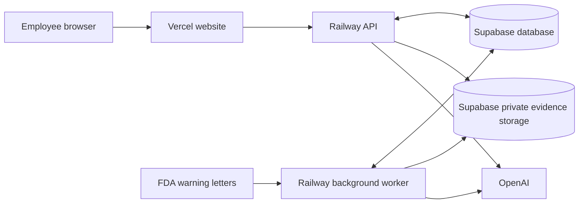

# Deploy the PharmaAgent OS backend to Railway

Updated 2026-09-09 for the new-account migration. **Two Railway services** use
Supabase project `iqevzrztpdiysnojzpur`; the website is hosted in the new Vercel
account. The imported dataset and 444 private source files are verified.

- Website: https://pharmaagent-os-ochre.vercel.app
- API readiness: https://daewoong-pharmaagentos-pharmaagentos.up.railway.app/health/ready
- Railway project: `ee39ef7f-694b-4ddb-b1c7-6cdbc078974b`
- Railway environment: `00fa2021-eaec-47ea-abc1-839572451872` (`PharmaAgentOS`)
- API service: `42a7b375-3b14-4563-bf06-8da4a946a43b`
- Worker service: `7685b37a-a658-4452-9769-f8dde80a7e13`
- Vercel project: `prj_M3zkIDEbNVQKqAC0rdMNjn8lzATx`, team `davemaxuellkr-9654`

The new Vercel project uses **Root Directory `apps/web`**, with
`apps/web/vercel.json`. The repository-root `vercel.json` is the legacy combined
Vercel API/worker deployment configuration; do not use it for this split setup.
For CLI deployment from the repository root, specify
`--local-config apps/web/vercel.json` and the new account's configuration/scope.
Git auto-deployment still requires the new Vercel account's GitHub login connection.



## 1. Create the two services

In Railway, create a project, then two empty services named `api` and `worker`.
Configure their variables/settings first, then connect each to
`its-davemaxuell/daewoong-PharmaAgentOS`, branch `main`, through **GitHub Repo**.
Both services build the same existing non-root Docker image.

The root `Dockerfile` makes a repository import automatically select the Python
API build. It mirrors `services/api/Dockerfile`; CI checks that they stay equal
and builds the root runtime image. Update both files when changing the image.

If a deployment reports **Detected Node / No start command detected**, deploy
the latest `main` revision. In the service's **Variables**, set
`RAILWAY_DOCKERFILE_PATH=services/api/Dockerfile`, keep **Root Directory** at `/`,
and deploy the changes. The build should report **Using detected Dockerfile!**.
The root npm package is local Supabase tooling, not the backend server. Continue
with the API or worker settings below and supply the environment variables in
section 2 before starting the service.

| Setting | `api` | `worker` |
| --- | --- | --- |
| Root Directory | `/` | `/` |
| Variable `RAILWAY_DOCKERFILE_PATH` | `services/api/Dockerfile` | `services/api/Dockerfile` |
| Custom Start Command | `python -m app.serve` | `python -m app.background_worker` |
| Healthcheck Path | `/health/ready` | Leave empty |
| Healthcheck Timeout | 300 seconds | Leave empty |
| Public Networking | Generate an HTTPS domain | No public domain |
| Replicas | 1 initially | 1 |
| Serverless / sleeping | Off | Off |
| Restart Policy | On Failure | On Failure |

Choose a region near the existing Supabase Sydney region. Railway supplies `PORT`
to the API; the server binds to `0.0.0.0`. Select that port when generating its
domain. Do not change the build root to `/services/api`: the Dockerfile also
copies contracts and reviewed runtime resources from the repository root.

Railway reads a custom Dockerfile path from `RAILWAY_DOCKERFILE_PATH`.
As of this preparation, new services cannot opt into the deprecated
`railway.json`/`railway.toml` configuration. The replacement TypeScript IaC is
applied through the CLI, rather than automatically on GitHub pushes. This guide
therefore uses GitHub source plus service settings directly.
[Dockerfile docs](https://docs.railway.com/builds/dockerfiles),
[configuration transition](https://docs.railway.com/config-as-code),
[IaC docs](https://docs.railway.com/infrastructure-as-code).

## 2. Add environment variables

Use each file as a template in the service's **Variables → Raw Editor**, replacing
every `REPLACE_...` value before deployment:

- API: [api.env.example](infra/deployment/railway/api.env.example)
- Worker: [worker.env.example](infra/deployment/railway/worker.env.example)

Copy the existing backend credentials/settings from your Vercel project into
Railway's service variables. Seal credential variables in Railway. No Railway
account token is required by the application.

| Value | What to use |
| --- | --- |
| API `DATABASE_URL` | Existing Supabase API-role connection string |
| Worker `DATABASE_URL` and `WORKER_DATABASE_URL` | Existing Supabase worker-role connection string in both fields |
| `SUPABASE_SECRET_KEY` | Existing server-side Supabase Storage secret/service-role key |
| `OPENAI_API_KEY` | Existing server-side OpenAI credential |
| `OIDC_PUBLIC_KEY` | Exact public key already used by the Vercel backend |
| `OIDC_ISSUER`, `OIDC_AUDIENCE` | Match the Vercel website's `API_SESSION_ISSUER` and `API_SESSION_AUDIENCE` |

Use the existing transaction-pooler database URLs, including `sslmode=require`.
The public Supabase URL or publishable key alone cannot provide database/storage
server access. The API and worker use different database roles; do not replace
them with the database owner's connection string.

The PEM public key can be pasted as a quoted multiline value or with literal
`\n` separators. Keep the signing **private** key and browser-session secret on
Vercel. The same signing setup preserves saved tasks and the current no-login
experience; no Google account or OAuth setup is involved.

Railway automatically supplies `RAILWAY_PROJECT_ID`, `RAILWAY_ENVIRONMENT_ID`,
`RAILWAY_SERVICE_ID` and its domain metadata. The application requires these for
`SECRET_PROVIDER=railway` and permits the exact Railway API/private domains and
healthcheck hostname. If you add a custom API domain, append its hostname to
`ALLOWED_HOSTS`. Use exact website HTTPS origins in `ALLOWED_ORIGINS`.

Reuse the existing schema and private `pharma-evidence` bucket. No Railway
database, storage volume, schema initialization or demo seed is required. Keep
`AUTO_CREATE_SCHEMA=false`. A different, empty Supabase project requires the
controlled migrations and runtime grants described in the
[deployment runbook](docs/runbooks/deploy-and-rollback.md) before startup.

## 3. Deploy and verify Railway

Deploy the API first, generate its public domain, and open:

```text
https://YOUR_API_DOMAIN/health/ready
```

Expect HTTP 200 with `status: ready` and both database/object-store checks `ok`.
Protected API routes still require the website's signed session. The readiness
endpoint exposes dependency status, without credentials or source contents.
Railway's deployment healthcheck uses `healthcheck.railway.app` and does not
provide continuous uptime monitoring after deployment.
[Healthcheck docs](https://docs.railway.com/deployments/healthchecks).

Deploy the worker. Look for JSON events `background_worker_started` and
`fda_ingestion_scheduled` in its logs. A previously queued ingestion run may be
resumed instead of a new schedule being created. The worker processes FDA
ingestion and research in separate asynchronous loops. Research execution
events continue to appear in the website's existing live task view.

For a read-only FDA connection check **inside the running worker container**, use
Railway CLI's remote command after selecting this project/environment:

```text
railway ssh --service worker -- python -m app.fda_probe --pages 2 --details 2
```

Expect `ok: true`, listing page counts and each sampled letter's scope. This
command makes no database writes. It intentionally waits at least 30 seconds
between source requests, so allow a few minutes. Local live-source verification
has passed; running this on Railway verifies its actual outbound network path.
[Remote command docs](https://docs.railway.com/cli/ssh).

## 4. Connect the Vercel website

Once Railway is ready, add these **server-side** variables to the Vercel website
and redeploy it:

```text
EXTERNAL_API_BASE_URL=https://YOUR_API_DOMAIN
RESEARCH_WORKER_MODE=poll
```

`EXTERNAL_API_BASE_URL` takes priority over Vercel's existing `API_BASE_URL`
service binding for library, chat, research, cases and exports. Do not add
`NEXT_PUBLIC_` to these names. `poll` tells the website that the Railway worker
consumes saved research tasks continuously.

Open the library, ask a cited question, then start a research task and confirm
live actions, Stop/Resume and the saved brief. Existing Supabase records and
browser ownership remain shared across both backends.

After Railway completes a real research task, you can retire the old Vercel
research worker's `RESEARCH_AGENT_ENABLED` setting and the existing Supabase
Cron job named `pharma-research-worker`. Brief overlap is supported by research
leases. Do not enable the old Vercel ingestion lane alongside the Railway
scraper. No cron or production variables were changed during this preparation.

Rollback: remove `EXTERNAL_API_BASE_URL` and `RESEARCH_WORKER_MODE`, restore the
old research worker/cron if retired, and redeploy the website. Stop Railway's
worker before enabling any replacement FDA ingestion consumer.

## FDA collection and recovery

- **Every 24 hours:** one durable discovery run scans the official FDA listing
  in descending posted-date order. The first run starts when the worker starts.
  It discovers the current server-side table endpoint and follows actual page
  lengths; empty, repeated or malformed pages fail for retry instead of falsely
  completing a partial scrape.
- **New, changed and stale letters:** within the rolling three-year discovery
  window, new letters and changed listing metadata are fetched; unchanged known
  letters are fetched again after 14 days. Existing records are retained under
  the separate five-year active-retention policy. A manually queued full
  reconciliation without a refresh cutoff still revisits every eligible letter.
- **Correct scope:** a detail page's FDA Product metadata decides admission.
  Drug letters receive retained source versions and searchable passages.
  Food/device-only or ambiguous letters retain scope metadata and do not enter
  drug search. Re-fetching unchanged text preserves its document version.
- **Respectful acquisition:** the scraper honors FDA robots rules, waits at
  least 30 seconds between requests and uses bounded retries. Large initial
  backfills can take hours. It does not bypass access denials or rate limits.
- **Restart safety:** each completed letter has a durable checkpoint. Graceful
  shutdown requeues ingestion; abrupt termination recovers after the five-minute
  lease expires. PostgreSQL serializes ingestion claims across overlapping
  worker deployments. Persistent failures exhaust bounded retries and remain
  visible for operator review; later schedules do not pile up behind active work.
- **Progress:** inspect `ingestion_runs.metrics` and `processing_jobs` in Supabase
  or existing admin tooling. Useful counters include `listing_rows`, `fetched`,
  `in_scope`, `out_of_scope`, `skipped_recent` and `failed`. Logs contain run/job
  IDs and counts. The current frontend's animated agent view shows research
  actions; it is not an FDA crawler progress screen.

If the worker repeatedly logs `ingestion_retry`, check database connectivity and
the worker-role grants first. `FdaSystemicAcquisitionError` or a failed probe
requires checking Railway's FDA access and retrying after the source recovers.
`ListingDiscoveryError` means the expected official representation changed or a
page was incomplete. Preserve the discovery snapshot and inspect the parser;
do not mark an incomplete run successful. See the
[ingestion runbook](docs/runbooks/ingestion-and-scope.md).

This profile keeps SMTP and the unqualified internal case-agent execution lanes
disabled. Evidence from this preparation is recorded in
[Railway qualification](docs/assurance/railway-20260909.md).
